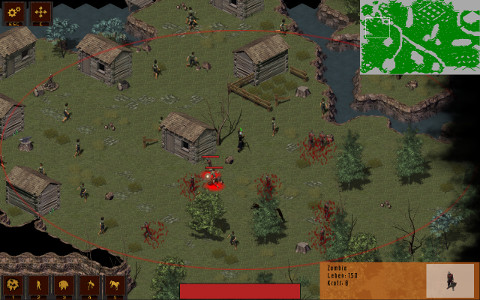

Vagram's Vicious Vengeance
======================

This video game was created at the [University of Freiburg](http://www.uni-freiburg.de/) during a lecture of the [Chair of Software Engineering](http://swt.informatik.uni-freiburg.de/). Six people with varying degrees of programming experience were randomly thrown together. They somehow made a game during summer 2016 which you can see here.

You are playing the necromancer Vagram, former personal wizard of King Harry. But when he was shamefully banished from the kingdom he swore fierce revenge. Now he is back with his dark arts to bring death and ruin to the whole kingdom.

The game is in german but there are no dialogs or anything like that. Most things should be self-explanatory.

* [For basic controls see here.](V3/CONTROLS.md)
* [See here for credits](V3/CREDITS.md) to the many talented people we used sounds and graphics from.

Dependencies
------------

* [MonoGame 3.5](http://www.monogame.net/)
* .Net 4.5 / alternatively [Mono 4.4](http://www.mono-project.com/)
* [OpenAL](http://www.openal.org/)

Screenshots
-----------------

