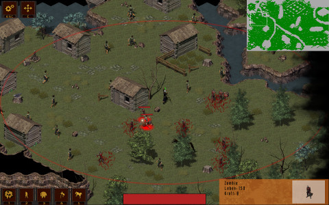
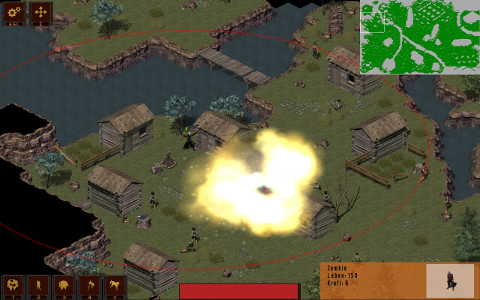
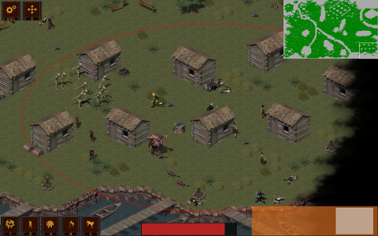

Vagram's Vicious Vengeance
======================

[For an english version see here.](README.en.md)

Dieses Videospiel ist im Rahmen des [Softwarepraktikums](https://sopra.informatik.uni-freiburg.de/) des [Lehrstuhls für Softwaretechnik](http://swt.informatik.uni-freiburg.de/) an der [Albert-Ludwigs-Universität Freiburg](http://www.uni-freiburg.de/) entstanden. Sechs zufällig zusammengewürfelte Leute mit unterschiedlicher Erfahrung saßen im Sommersemester 2016 zusammen und haben irgendwas zurechtgehackt.

Verwendet wurde das [MonoGame-Framework](http://www.monogame.net/) und eine Menge freier Sounds und Grafiken, die gesondert [in den CREDITS](V3/CREDITS.md) gelistet werden.

Die Steuerung erfolgt vorwiegend über die Maus und ist ziemlich konservativ. Dennoch gibt es eine [Übersicht über die möglichen Befehle hier](V3/CONTROLS.md).

Zusammenfassung des Spiels
--------------------------

*"Pest und Verderben! Seid verflucht! Wie konntet Ihr mir das antun? Den Tod über eure Sippe! Über euer Land! Mit eigenen Händen werde ich dieses Königreich vernichten, und wenn es mich meine Seele kosten mag."*

Als ehemaliger Hofzauberer Vagrant kennt Ihr nur noch ein Ziel: Rache an König Harry, der verantwortlich für den Tod Eurer Familie ist. Auf Euch allein gestellt ohne auch nur einen Verbündeten bleibt euch dazu nur ein Mittel: Die verbotene Kunst der Totenbeschwörung. 

Pilgert durch das Königreich und hinterlasst eine Spur des Verwüstung. Entvölkert ganze Dörfer und fügt die wiederbelebten Kadaver Eurer Zombiearmee hinzu. Zerstört wo und was Ihr nur könnt und nutzt die Überbleibsel zur Verstärkung Eurer willenlosen Streitkräfte. Verschmelzt in unheiligen Ritualen Eure Kreaturen zu noch mächtigeren Monstrositäten. Überrennt die verblendeten Vasallen des Königs mit euren Dienern aus Knochen und verwesendem Fleisch, denn sie haben es verdient. Jeder Nachkomme des verhassten Königs muss ausgemerzt werden um Euren Durst nach Rache zu stillen.

In dieser Mischung aus Action-RPG und Echtzeitstrategie geht es nicht um Aufbau und Eroberung. Kein Stein darf auf dem anderen bleiben, wollt Ihr Erfolg haben. Im Rahmen der Kampagne führt ihr Kapitel für Kapitel das Königreich seinem Untergang entgegen. Und nun legt alle Skrupel ab, denn für Erlösung ist es längst zu spät.

Alleinstellungsmerkmale
-----------------------

Bei Vagrant's Vicious Vengeance soll eine offensive und risikoreiche Spielweise gefördert werden. Aus diesem Grund wird einerseits auf Aufbauelemente verzichtet. Einheiten werden aus Kadavern erschaffen, die durch die menschliche Bevölkerung einer Karte begrenzt sind. Einheiten können ebenfalls verstärkt werden, lässt man sie Gebäude zertrümmern und die Überreste plündern. Auch diese sind nur begrenzt vorhanden. 

Andererseits ist der Totenbeschwörer selbst von zentraler Bedeutung: Ist er nicht anwesend, können die erschaffenen Einheiten nicht kontrolliert werden. Nur in seiner Gegenwart können Befehle erteilt und Spezialfähigkeiten aktiviert werden. Außerdem können Einheiten kombiniert werden, um noch mächtigere Zombies zu erschaffen. Für sich selbst genommen besitzt der Totenbeschwörer jedoch keine Angriffsmöglichkeiten, somit ist er also ohne beschworene Einheiten komplett wehrlos.

*Weiteres langweiliges Palaver darf gerne dem [Game Design Document](GDD.pdf) entnommen werden.*

Abhängigkeiten
-------------------

* [MonoGame 3.5](http://www.monogame.net/)
* .Net 4.5 / alternativ [Mono 4.4](http://www.mono-project.com/)
* [OpenAL](http://www.openal.org/)

Screenshots
-----------------

Bekannte Probleme
--------------------

* Unter Linux werden keine Umlaute angezeigt.
* Temporärer Framerateeinbruch, wenn man sehr vielen Einheiten auf einmal den Laufbefehl gibt.
